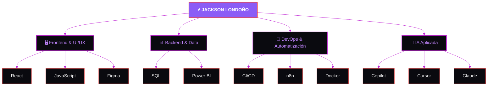

<h1 align="center">JACKSON LONDOÑO</h1>

<p align="center">


</p>

<p align="center"></p>

<br/>

> [!IMPORTANT]
> **Enfoque actual:** lidero el desarrollo de varios proyectos de software en SL Humanik, con foco en interfaces, diseño y experiencia de usuario para aplicaciones internas del área STEM.

<br/>

## 👋&nbsp; Sobre mí

Desarrollador **frontend** enfocado en **experiencia de usuario e innovación de interfaz** — no me limito a implementar diseños, identifico dónde una interfaz puede mejorar y tomo la iniciativa para lograrlo.

```yaml
rol_actual:    AI Software Developer @ SL Humanik
enfoque:       Frontend · UI/UX · Innovación de interfaz
stack_base:    React · JavaScript · HTML/CSS
complementos:  SQL · Power BI · CI/CD · n8n
filosofia:     "el buen diseño es parte del código,
                no un extra de último momento"
```

<br/>

## 🧠&nbsp; Stack, visualizado



<br/>

## 🎯&nbsp; En qué me enfoco

<table width="100%">
<tr>
<td width="50%" valign="top">

**🖥️ Frontend & UI/UX**
Construyo interfaces con React pensando primero en cómo las va a usar una persona real — no solo en que "funcionen".

**🔁 Automatización**
Flujos de trabajo con n8n y pipelines CI/CD para que las cosas repetitivas dejen de robar tiempo del trabajo que sí importa.

</td>
<td width="50%" valign="top">

**📊 Data**
SQL y Power BI para convertir datos sueltos en decisiones — cuando un proyecto lo pide, entro también en esa parte.

**🤖 IA aplicada al desarrollo**
Copilot, Cursor y Claude como parte natural de mi flujo — el criterio técnico sigue siendo mío, la IA lo ejecuta más rápido.

</td>
</tr>
</table>

<br/>

## 🛠️&nbsp; Herramientas

<div align="center">


<br/>


<br/>


<br/>


</div>

<br/>

## 🧭&nbsp; Cómo trabajo

<table width="100%">
<tr>
<td width="33%" align="center" valign="top">

### 🔭
**Lidero proyectos**
en producción, sosteniendo calidad incluso con recursos limitados

</td>
<td width="33%" align="center" valign="top">

### 🌱
**Aprendo constantemente**
cada proyecto es una oportunidad para sumar una herramienta o enfoque nuevo

</td>
<td width="33%" align="center" valign="top">

### 🎯
**Busco impacto real**
pienso en arquitectura escalable y en cómo una interfaz cambia la experiencia de quien la usa

</td>
</tr>
</table>

<br/>

> [!CAUTION]
> **Disponibilidad:** abierto a nuevas oportunidades como Frontend Developer / UI Engineer.

<br/>

<div align="center">

## 📫&nbsp; Conectemos

<a href="mailto:alexisjacksonlon213@gmail.com">
  
</a>
<a href="https://www.linkedin.com/in/TU-USUARIO" target="_blank">
  
</a>
<a href="https://tu-portfolio.com" target="_blank">
  
</a>

</div>